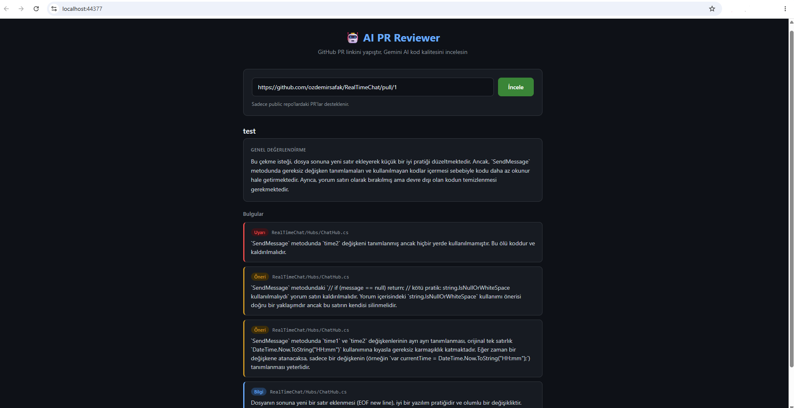
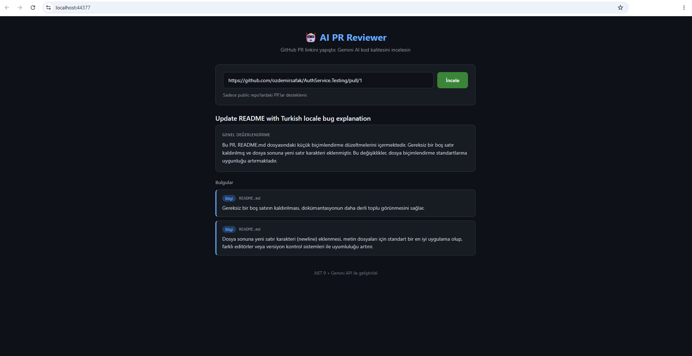

# 🤖 AI PR Reviewer

GitHub Pull Request linkini yapıştır, Gemini AI kod kalitesi açısından otomatik inceleme yapsın.

<!-- 🔴 Canlı Demo: (deploy sonrası link eklenecek) -->

## Nasıl Çalışır

1. Kullanıcı bir GitHub PR linki girer (`https://github.com/owner/repo/pull/123`)
2. Backend, GitHub REST API üzerinden PR'daki dosya değişikliklerini (diff) çeker
3. Diff, Gemini API'sine gönderilir; okunabilirlik, isimlendirme ve best practice
   açısından yapılandırılmış bir JSON formatında inceleme istenir
4. Sonuç, önem derecesine göre renklendirilmiş bulgular halinde arayüzde gösterilir

## Ekran Görüntüsü




Yukarıdaki örnekte, kasıtlı olarak eklenen `message == null` kontrolü AI tarafından
tespit edilmiş ve `string.IsNullOrWhiteSpace` kullanılması önerilmiştir.

## Teknolojiler

- .NET 9 / ASP.NET Core Web API
- Google Gemini API (`gemini-2.5-flash`)
- GitHub REST API (token gerektirmez, public repo'lar için)
- Vanilla JavaScript frontend
- `System.Text.Json` ile yapılandırılmış AI çıktısı ayrıştırma

## Mimari

| Bileşen | Görev |
|---|---|
| `GitHubService` | PR linkini ayrıştırır, GitHub API'den diff çeker |
| `GeminiService` | Diff'i AI'ya gönderir, JSON formatında inceleme alır |
| `ReviewController` | İki servisi birleştirir, sonucu API olarak sunar |

## Çalıştırma

1. [Google AI Studio](https://aistudio.google.com/apikey)'dan ücretsiz bir Gemini API key alın
2. Projeye User Secrets ile ekleyin:
```bash
   dotnet user-secrets set "Gemini:ApiKey" "BURAYA_KEY"
```
3. Çalıştırın:
```bash
   dotnet run
```

> Not: Sadece **public** GitHub repo'larındaki PR'lar desteklenir (token gerektirmediği için).
> Bu proje demo amaçlıdır.
